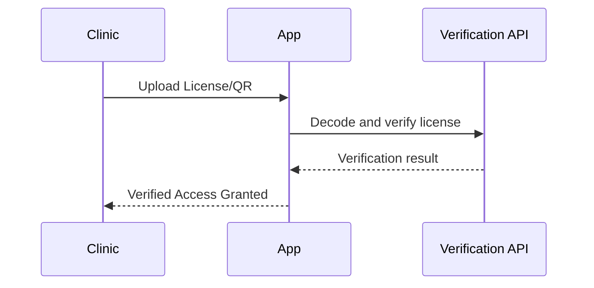
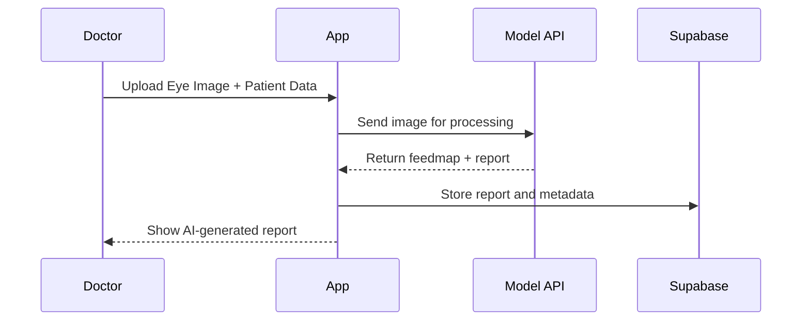
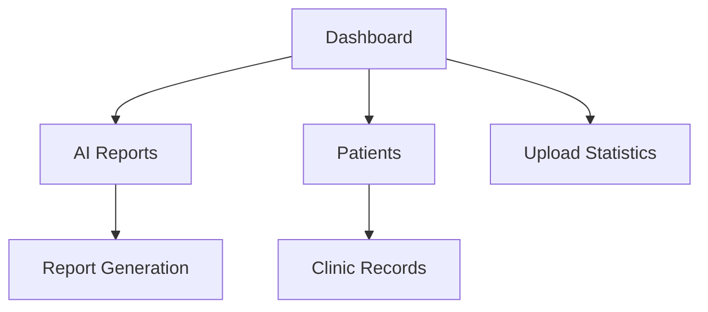

# 👁️ NetraAI - Intelligent Eye Report Generation Platform

<div align="center">

[Demo Link](#)

**AI-Powered Ophthalmic Diagnostics and Report Automation**

[](https://nextjs.org/)
[](#)
[](https://supabase.com/)
[](LICENSE)

</div>

## 🚀 Overview

NetraAI is an advanced AI-based ophthalmic reporting system designed for clinics and diagnostic centers. It enables doctors to generate AI-analyzed eye health reports using uploaded retinal or eye images. With features like clinic verification, patient data management, and automated report creation, NetraAI brings efficiency and accuracy to modern eye diagnostics.

### 🌟 Key Features

* **👁️ AI-Powered Eye Analysis**: Upload eye images and get automated AI-generated feed maps and health insights.
* **🏥 Clinic Verification System**: Secure clinic validation via license or QR verification.
* **📄 AI Report Generation**: Doctor-tagged, patient-linked reports generated seamlessly.
* **📤 Image Upload Pipeline**: Real-time progress tracking with validation and compression.
* **📊 Dashboard Overview**: Manage reports, patients, and upload analytics in one place.
* **🔐 Auth System**: Secure login/signup for verified clinic access.
* **💬 Responsive UI/UX**: Built with reusable and animated UI components.

---

## 🏗️ Architecture


### Core Modules

* **Frontend (Next.js)**: Dynamic routing and rendering for dashboard and forms.
* **AI Pipeline (Report Generator)**: Handles uploaded images and runs AI inference for visual diagnostics.
* **API Routes (Next.js)**: Serverless endpoints for clinic verification and AI report management.
* **Database (Supabase)**: Stores clinic, patient, and report metadata.

---

## 🧱 Technology Stack

### ⚙️ Frameworks & Libraries

* **Next.js 14 (App Router)**: Modern SSR/ISR frontend framework.
* **React 18**: Component-driven architecture.
* **Tailwind CSS**: Utility-first styling.
* **Framer Motion**: Smooth UI animations.

### 🤖 AI & Logic

* **Custom Vision Model**: Image-based AI analysis for eye reports.
* **Helper Scripts**: Utility functions for formatting and AI inference pipelines.

### 🗄️ Storage & Database

* **Supabase**: Authentication, storage, and database backend.
* **Cloud Storage**: Image storage and retrieval pipeline.

### 🧩 Utilities & Tools

* **ESLint**: Code linting.
* **PostCSS**: Tailwind optimization.
* **Zustand**: Lightweight state management.

---

## 📁 Directory Structure

```bash
appajidheeraj-netraai/
├── README.md
├── components.json
├── eslint.config.mjs
├── jsconfig.json
├── next.config.mjs
├── package.json
├── postcss.config.mjs
└── src/
    ├── app/
    │   ├── globals.css
    │   ├── layout.js
    │   ├── page.js
    │   ├── (auth)/
    │   │   ├── login/page.jsx
    │   │   └── signup/page.jsx
    │   ├── (dashboard)/
    │   │   ├── layout.jsx
    │   │   ├── page.jsx
    │   │   └── ai-report/page.jsx
    │   └── api/verify-clinic/route.js
    ├── components/
    │   ├── core UI components (buttons, dialogs, forms)
    │   ├── login/signup forms
    │   └── theme and responsive utilities
    ├── hooks/
    │   ├── use-file-upload.js
    │   └── use-mobile.js
    ├── lib/
    │   ├── helpers.js
    │   ├── utils.js
    │   └── verified-clinics.js
    └── modules/
        ├── ai-report/
        │   └── ui/components/
        │       ├── ai-report-form.jsx
        │       ├── new-ai-report-dialog.jsx
        │       ├── new-person-dialog.jsx
        │       └── person-form.jsx
        └── dashboard/
            └── ui/components/
                ├── dashboard-command.jsx
                ├── dashboard-navbar.jsx
                ├── dashboard-sidebar.jsx
                └── dashboard-user-button.jsx
```

---

## ⚡ Quick Start

### Prerequisites

* Node.js 18+
* npm or yarn
* Supabase project (for DB + Auth)

### Installation

```bash
git clone https://github.com/ajidheeraj/appajidheeraj-netraai.git
cd appajidheeraj-netraai
npm install
```

### Setup Environment

Create a `.env.local` file:

```env
NEXT_PUBLIC_SUPABASE_URL=your_supabase_url
NEXT_PUBLIC_SUPABASE_ANON_KEY=your_anon_key
AI_MODEL_ENDPOINT=your_ai_inference_api
```

### Run Development Server

```bash
npm run dev
```

Visit: `http://localhost:3000`

---

## 🧬 Core Workflows

### 1. 🏥 Clinic Verification Flow



**Highlights:**

* License/QR verification before report generation.
* Verification cached via Supabase DB.

### 2. 👁️ AI Report Flow



**Features:**

* Upload retina or cornea images.
* Generates diagnostic feed maps and health metrics.
* Stores AI and doctor details together.

### 3. 📊 Dashboard Workflow



**Dashboard Modules:**

* Patient list
* Report history
* Upload tracking
* AI performance metrics

---

## 💻 UI Overview

* **Login/Signup Pages**: Authentication and onboarding.
* **Dashboard Page**: Report overview and access.
* **AI Report Page**: Form to upload patient details and generate reports.
* **Components Library**: Modular, reusable UI elements from `/components/ui/`.

---

## 🔒 Security & Privacy

* **Clinic Verification** ensures trusted data sources.
* **Encrypted Uploads** for sensitive image data.
* **Supabase Auth** for session and data protection.
* **Client-Side AI Calls** with anonymized patient info.

---

## 📜 Future Enhancements

* Integration with blockchain for immutable report proof.
* Doctor–patient decentralized record access.
* AI model fine-tuning using anonymized datasets.
* Automated PDF report export.

---

## 🙌 Acknowledgments

* **Supabase** for backend infrastructure
* **Next.js** for powerful full-stack development
* **TailwindCSS** for seamless styling
* **Framer Motion** for animations

---

<div align="center">

**👁️ Making Eye Diagnostics Smarter, Faster, and More Accessible**
Built with ❤️ by Dheeraj, Vivin and Kshama for Build for Builders Hackathon 2025

</div>
