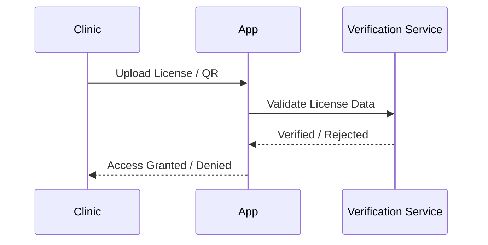
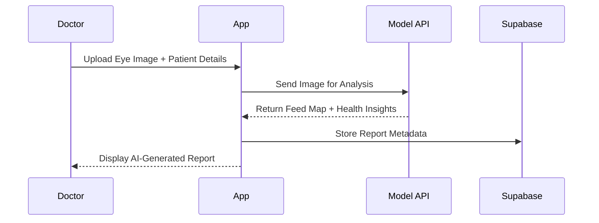
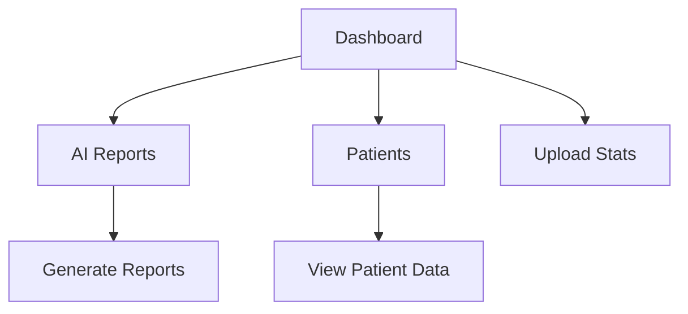

# 👁️ NetraAI — Intelligent Eye Report Generation Platform

<div align="center">

[Live Demo](#) • [Project Video](https://www.loom.com/share/your-video-link) • [Slides](https://your-presentation-link)

**AI-Powered Ophthalmic Diagnostics and Automated Report Generation**

[](https://nextjs.org/)
[](#)
[](https://supabase.com/)
[](LICENSE)

</div>

---
## 🧠 Problem Statement

Retinal diseases like glaucoma, diabetic retinopathy, and macular degeneration are often impossible to detect early, even by experienced ophthalmologists.
Subtle retinal layer changes — invisible to the naked eye — are only captured through OCT (Optical Coherence Tomography) scans. Yet, interpreting OCT data is complex, time-consuming, and prone to human variability.

Millions lose their vision not because treatment doesn’t exist, but because signs were missed early.
Additionally, inconsistent diagnostic standards and scattered OCT data lead to poor data integrity and hinder long-term patient tracking.

## 💡 Our Vision

We envision a world where no one goes blind because of late detection — regardless of where they live or how much they earn.
Our mission is to democratize precision eye diagnostics using accessible AI tools that assist doctors, empower clinics, and make retinal screening part of every basic eye check-up.

## 🔬 The Solution

NetraAI is an AI-powered retinal disease detection platform that identifies invisible, early-stage eye disorders using standard fundus images — no expensive OCT required.

How It Works:
- Clinics Register → Verified clinics sign up on the platform.
- Upload Retinal Images → Health workers capture fundus images using low-cost fundus cameras or smartphones with adapters.
- AI Diagnosis → Our proprietary model analyzes retinal images and detects early signs of diseases like diabetic retinopathy or glaucoma — often before visible symptoms appear.
- Doctor Assist Dashboard → Doctors receive structured reports, highlighting risk zones, confidence levels, and AI recommendations — designed to assist, not replace clinical judgment.
- Patient Insights → Patients get a simplified report with next-step guidance (visit specialist, follow-up, etc.).

---


## 🏗️ Architecture


---

## 🌍 Dual-Model Approach: Impact + Sustainability

We operate on a hybrid CSR-driven model:

1.  Rural & Semi-Urban Clinics
- Partner with government/CSR-backed hospitals and NGOs.
- Free screening for patients holding ESI cards or verified under economically unstable categories.
- AI-assisted reports and awareness sessions for early intervention.
Verified access ensures services are limited to eligible individuals.
2.  Urban Subscription Model
- Clinics and hospitals subscribe to VisionSight D++ — a premium AI diagnostic assistant.
- Offers faster reports, patient management dashboards, and deeper analytics.
- Revenue from this model fuels free screening initiatives in rural sectors.

---

### ✨ What Makes It Stand Out

* **👁️ AI-Powered Diagnostics** — Upload an eye image and get automated AI insights with visual heatmaps.
* **🏥 Clinic Verification System** — Clinics get verified using license or QR-based authentication.
* **📄 Automated Report Generation** — Doctors can link reports to patient profiles and export them seamlessly.
* **📊 Interactive Dashboard** — Manage patients, reports, uploads, and AI metrics in one clean interface.
* **🔐 Secure Auth System** — Only verified clinics can access and generate reports.
* **💫 Modern, Responsive UI** — Sleek design with smooth animations and modular components.

---

### 🔍 Core Components

| Module                   | Description                                                             |
| ------------------------ | ----------------------------------------------------------------------- |
| **Frontend (Next.js)**   | Handles routing, dashboards, and dynamic rendering.                     |
| **AI Pipeline**          | Analyzes images, generates diagnostic overlays, and interprets results. |
| **API Routes (Next.js)** | Serverless endpoints for verification, AI reports, and data handling.   |
| **Database (Supabase)**  | Stores clinic, patient, and report metadata securely.                   |

---

## ⚙️ Tech Stack

### 🧩 Frameworks & Libraries

* **Next.js 14 (App Router)** — Modern SSR/ISR frontend architecture.
* **React 18** — Component-based UI development.
* **Tailwind CSS** — Utility-first styling framework.
* **Framer Motion** — Smooth, fluid animations.

### 🤖 AI & Logic

* **Custom Computer Vision Model** — Detects eye-related features and abnormalities.
* **AI Inference Scripts** — Python-based inference pipeline integrated via API.

### ☁️ Storage & Backend

* **Supabase** — Handles authentication, database, and object storage.
* **Cloud Storage** — Manages high-resolution image uploads and retrieval.

### 🧠 Utilities

* **Zustand** — Lightweight state management.
* **ESLint & PostCSS** — Linting and CSS optimization.

---

## 🗂️ Folder Structure

```bash
netraai/
├── README.md
├── package.json
├── next.config.mjs
└── src/
    ├── app/
    │   ├── (auth)/login, signup
    │   ├── (dashboard)/layout, ai-report
    │   ├── api/verify-clinic/route.js
    │   └── globals.css
    ├── components/
    │   ├── core/ (buttons, forms, modals)
    │   └── ui/ (dashboard, dialogs)
    ├── hooks/ (custom React hooks)
    ├── lib/ (helpers, utils, constants)
    └── modules/
        ├── ai-report/
        └── dashboard/
```

---

## ⚡ Getting Started

### 1️⃣ Prerequisites

* Node.js 18+
* npm or yarn
* Supabase project setup

### 2️⃣ Installation

```bash
git clone https://github.com/appajidheeraj/netraai.git
cd netraai
npm install
```

### 3️⃣ Environment Variables

Create a `.env.local` file:

```bash
NEXT_PUBLIC_SUPABASE_URL=your_supabase_url
NEXT_PUBLIC_SUPABASE_ANON_KEY=your_anon_key
AI_MODEL_ENDPOINT=your_model_endpoint
```

### 4️⃣ Run Development Server

```bash
npm run dev
```

Visit `http://localhost:3000`

---

## 🧬 Core Workflows

### 🏥 Clinic Verification



**Purpose:** Ensures only licensed clinics can generate patient reports.

---

### 👁️ AI Report Generation



**Outcome:** Doctors receive AI-analyzed reports with feedmaps and predictions.

---

### 📊 Dashboard Flow



**Includes:**

* Report History
* Patient Records
* Upload Analytics
* Clinic Profile

---

## 🎨 UI Walkthrough

* **Login / Signup** — Secure authentication for clinics.
* **Dashboard** — Access reports, patients, and insights.
* **AI Report Page** — Upload, analyze, and generate reports.
* **Dialog Components** — Patient and report input modals.

---

## 🔒 Security & Privacy

* ✅ **Verified Access Only** — Clinics are validated before access.
* 🔐 **Encrypted Uploads** — Sensitive patient images are secured.
* 🧾 **Supabase Auth** — Robust session and access management.
* 🧠 **Anonymized Data** — Patient data used in AI inference remains private.

---

## 🧭 Future Roadmap

* 📜 PDF Report Export
* 🔗 Blockchain-based Record Verification
* ⚕️ Fine-tuned AI Models with Real Data
* 🌐 Multi-Language Support

---

## 💡 Inspiration

> *We wanted to bridge the gap between AI innovation and accessible healthcare — empowering clinics to diagnose faster and smarter.*

---

<div align="center">

**👁️ NetraAI — Making Eye Diagnostics Smarter, Faster, and More Accessible**
Built with ❤️ by *Dheeraj, Vivin, and Kshama* for **Build for Builders Hackathon 2025**

</div>
